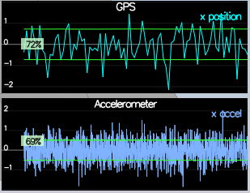
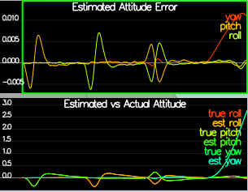
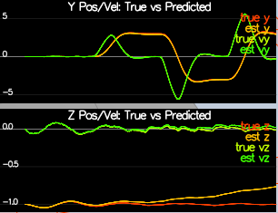
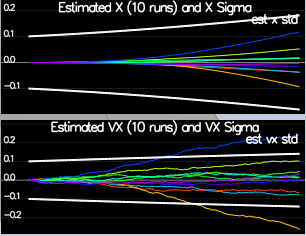
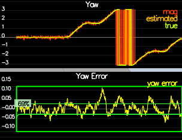
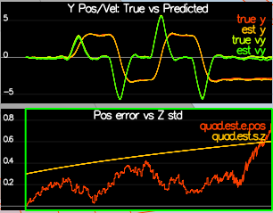

# FCND Estimation Project

## Step 1: Sensor Noise
From the log files the estimated standard deviation:
- `MeasuredStdDev_GPSPosXY`: 0.7221
- `MeasuredStdDev_AccelXY`: 0.5131

When running the simulation is indicated as passing for these values.



## Step 2: Attitude Estimation 
For this step we implemented the method `UpdateFromIMU()`, this function first transfort the Euler angles into a quaternion then integrate the gyro values. The final step is to filter out the values with the previous values. 

```
void QuadEstimatorEKF::UpdateFromIMU(V3F accel, V3F gyro)
{
  // Improve a complementary filter-type attitude filter
  // 
  // Currently a small-angle approximation integration method is implemented
  // The integrated (predicted) value is then updated in a complementary filter style with attitude information from accelerometers
  // 
  // Implement a better integration method that uses the current attitude estimate (rollEst, pitchEst and ekfState(6))
  // to integrate the body rates into new Euler angles.
  //
  // HINTS:
  //  - there are several ways to go about this, including:
  //    1) create a rotation matrix based on your current Euler angles, integrate that, convert back to Euler angles
  //    OR 
  //    2) use the Quaternion<float> class, which has a handy FromEuler123_RPY function for creating a quaternion from Euler Roll/PitchYaw
  //       (Quaternion<float> also has a IntegrateBodyRate function, though this uses quaternions, not Euler angles)

  ////////////////////////////// BEGIN STUDENT CODE ///////////////////////////
  // SMALL ANGLE GYRO INTEGRATION:
  // (replace the code below)
  // make sure you comment it out when you add your own code -- otherwise e.g. you might integrate yaw twice


  Quaternion<float> attitude = Quaternion<float>::FromEuler123_RPY(rollEst, pitchEst, ekfState(6)).IntegrateBodyRate(gyro, dtIMU);
  ekfState(6) = attitude.ToEulerRPY().z;

  float predictedRoll = attitude.Roll();
  float predictedPitch = attitude.Pitch();

  // normalize yaw to -pi .. pi
  if (ekfState(6) > F_PI) ekfState(6) -= 2.f * F_PI;
  if (ekfState(6) < -F_PI) ekfState(6) += 2.f * F_PI;

  /////////////////////////////// END STUDENT CODE ////////////////////////////

  // CALCULATE UPDATE
  accelRoll = atan2f(accel.y, accel.z);
  accelPitch = atan2f(-accel.x, 9.81f);

  // FUSE INTEGRATION AND UPDATE
  rollEst = attitudeTau / (attitudeTau + dtIMU) * (predictedRoll)+dtIMU / (attitudeTau + dtIMU) * accelRoll;
  pitchEst = attitudeTau / (attitudeTau + dtIMU) * (predictedPitch)+dtIMU / (attitudeTau + dtIMU) * accelPitch;

  lastGyro = gyro;
}
```



## Step 3: Prediction Step


This step required the following implementations:

```
VectorXf QuadEstimatorEKF::PredictState(VectorXf curState, float dt, V3F accel, V3F gyro)
{
  assert(curState.size() == QUAD_EKF_NUM_STATES);
  VectorXf predictedState = curState;
  // Predict the current state forward by time dt using current accelerations and body rates as input
  // INPUTS: 
  //   curState: starting state
  //   dt: time step to predict forward by [s]
  //   accel: acceleration of the vehicle, in body frame, *not including gravity* [m/s2]
  //   gyro: body rates of the vehicle, in body frame [rad/s]
  //   
  // OUTPUT:
  //   return the predicted state as a vector

  // HINTS 
  // - dt is the time duration for which you should predict. It will be very short (on the order of 1ms)
  //   so simplistic integration methods are fine here
  // - we've created an Attitude Quaternion for you from the current state. Use 
  //   attitude.Rotate_BtoI(<V3F>) to rotate a vector from body frame to inertial frame
  // - the yaw integral is already done in the IMU update. Be sure not to integrate it again here

  Quaternion<float> attitude = Quaternion<float>::FromEuler123_RPY(rollEst, pitchEst, curState(6));

  ////////////////////////////// BEGIN STUDENT CODE ///////////////////////////
  predictedState(0) += curState(3) * dt;
  predictedState(1) += curState(4) * dt;
  predictedState(2) += curState(5) * dt;

  V3F accel_inertial = attitude.Rotate_BtoI(accel);
  predictedState(3) += accel_inertial.x * dt;
  predictedState(4) += accel_inertial.y * dt;
  predictedState(5) += accel_inertial.z * dt - CONST_GRAVITY * dt;
  // we are not integrating yaw here
  predictedState(6) = curState(6) ; 

  /////////////////////////////// END STUDENT CODE ////////////////////////////

  return predictedState;
}
```
MatrixXf QuadEstimatorEKF::GetRbgPrime(float roll, float pitch, float yaw)
{
  // first, figure out the Rbg_prime
  MatrixXf RbgPrime(3, 3);
  RbgPrime.setZero();

  // Return the partial derivative of the Rbg rotation matrix with respect to yaw. We call this RbgPrime.
  // INPUTS: 
  //   roll, pitch, yaw: Euler angles at which to calculate RbgPrime
  //   
  // OUTPUT:
  //   return the 3x3 matrix representing the partial derivative at the given point

  // HINTS
  // - this is just a matter of putting the right sin() and cos() functions in the right place.
  //   make sure you write clear code and triple-check your math
  // - You can also do some numerical partial derivatives in a unit test scheme to check 
  //   that your calculations are reasonable

  ////////////////////////////// BEGIN STUDENT CODE ///////////////////////////
  const float theta = pitch;
  const float phi = roll;
  const float psi = yaw;

  RbgPrime(0, 0) = -cos(theta) * sin(psi);
  RbgPrime(1, 0) = cos(theta) * cos(psi);

  RbgPrime(0, 1) = -sin(phi) * sin(theta) * sin(psi) - cos(phi) * cos(psi);
  RbgPrime(1, 1) = sin(phi) * sin(theta) * cos(psi) - cos(phi) * sin(psi);

  RbgPrime(0, 2) = -cos(phi) * sin(theta) * sin(psi) + sin(phi) * cos(psi);
  RbgPrime(1, 2) = cos(phi) * sin(theta) * cos(psi) + sin(phi) * sin(psi);

  /////////////////////////////// END STUDENT CODE ////////////////////////////

  return RbgPrime;
}
```
void QuadEstimatorEKF::Predict(float dt, V3F accel, V3F gyro)
{
  // predict the state forward
  VectorXf newState = PredictState(ekfState, dt, accel, gyro);

  // Predict the current covariance forward by dt using the current accelerations and body rates as input.
  // INPUTS: 
  //   dt: time step to predict forward by [s]
  //   accel: acceleration of the vehicle, in body frame, *not including gravity* [m/s2]
  //   gyro: body rates of the vehicle, in body frame [rad/s]
  //   state (member variable): current state (state at the beginning of this prediction)
  //   
  // OUTPUT:
  //   update the member variable cov to the predicted covariance

  // HINTS
  // - update the covariance matrix cov according to the EKF equation.
  // 
  // - you may find the current estimated attitude in variables rollEst, pitchEst, state(6).
  //
  // - use the class MatrixXf for matrices. To create a 3x5 matrix A, use MatrixXf A(3,5).
  //
  // - the transition model covariance, Q, is loaded up from a parameter file in member variable Q
  // 
  // - This is unfortunately a messy step. Try to split this up into clear, manageable steps:
  //   1) Calculate the necessary helper matrices, building up the transition jacobian
  //   2) Once all the matrices are there, write the equation to update cov.
  //
  // - if you want to transpose a matrix in-place, use A.transposeInPlace(), not A = A.transpose()
  // 

  // we'll want the partial derivative of the Rbg matrix
  MatrixXf RbgPrime = GetRbgPrime(rollEst, pitchEst, ekfState(6));

  // we've created an empty Jacobian for you, currently simply set to identity
  MatrixXf gPrime(QUAD_EKF_NUM_STATES, QUAD_EKF_NUM_STATES);
  gPrime.setIdentity();

  ////////////////////////////// BEGIN STUDENT CODE ///////////////////////////
  gPrime(0, 3) = dt;
  gPrime(1, 4) = dt;
  gPrime(2, 5) = dt;

  gPrime(3, 6) = dt * (RbgPrime(0, 0) * accel[0] + RbgPrime(0, 1) * accel[1] + RbgPrime(0, 2) * accel[2]);
  gPrime(4, 6) = dt * (RbgPrime(1, 0) * accel[0] + RbgPrime(1, 1) * accel[1] + RbgPrime(1, 2) * accel[2]);
  gPrime(5, 6) = dt * (RbgPrime(2, 0) * accel[0] + RbgPrime(2, 1) * accel[1] + RbgPrime(2, 2) * accel[2]);

  ekfCov = gPrime * ekfCov * gPrime.transpose() + Q;
  /////////////////////////////// END STUDENT CODE ////////////////////////////

  ekfState = newState;
}
```

For the scenario number 8 we get the following result, by analyzing the graph the estimation seems to be close to the actual state. Except for the altitude which seems to drift.



In the scenario number 9 we fined tunning the filters parameters on the position. By looking at the covariance matrix evolution.



The fine tunning of the filter resulted in the following parameter values. 

```
QPosXYStd = .1
QPosZStd = .05
QVelXYStd = .1
QVelZStd = .1
```

## Step 4: Magnetometer Update

```
void QuadEstimatorEKF::UpdateFromMag(float magYaw)
{
  VectorXf z(1), zFromX(1);
  z(0) = magYaw;

  MatrixXf hPrime(1, QUAD_EKF_NUM_STATES);
  hPrime.setZero();

  // MAGNETOMETER UPDATE
  // Hints: 
  //  - Your current estimated yaw can be found in the state vector: ekfState(6)
  //  - Make sure to normalize the difference between your measured and estimated yaw
  //    (you don't want to update your yaw the long way around the circle)
  //  - The magnetomer measurement covariance is available in member variable R_Mag
  ////////////////////////////// BEGIN STUDENT CODE ///////////////////////////
  hPrime(0, 6) = 1;
  zFromX(0) = ekfState(6);
 
  // normalizing
  float dpsi = (z - zFromX)(0);
  if (dpsi > F_PI)
  {
      zFromX(0) += 2.f * F_PI;
  }
  else if (dpsi < -F_PI)
  {
      zFromX(0) -= 2.f * F_PI;
  }

  /////////////////////////////// END STUDENT CODE ////////////////////////////

  Update(z, hPrime, R_Mag, zFromX);
}
```

The implementation of the measurement update is quite straight forward. After a few try the fine tunning resulted in the following estimated standard deviation for the yaw.

```
QYawStd = .08
```

The nex capture show a successful atttempt.



## Step 5: Closed Loop + GPS Update

The result for this step will be displayed in the step 6 section which display a result after all asked modification.

```
void QuadEstimatorEKF::UpdateFromGPS(V3F pos, V3F vel)
{
  VectorXf z(6), zFromX(6);
  z(0) = pos.x;
  z(1) = pos.y;
  z(2) = pos.z;
  z(3) = vel.x;
  z(4) = vel.y;
  z(5) = vel.z;

  MatrixXf hPrime(6, QUAD_EKF_NUM_STATES);
  hPrime.setZero();

  // GPS UPDATE
  // Hints: 
  //  - The GPS measurement covariance is available in member variable R_GPS
  //  - this is a very simple update
  ////////////////////////////// BEGIN STUDENT CODE ///////////////////////////
  // set measurement matrix prime
  hPrime(0,0) = 1;
  hPrime(1,1) = 1;
  hPrime(2,2) = 1;
  hPrime(3,3) = 1;
  hPrime(4,4) = 1;
  hPrime(5,5) = 1;

  zFromX(0) = ekfState(0);
  zFromX(1) = ekfState(1);
  zFromX(2) = ekfState(2);
  zFromX(3) = ekfState(3);
  zFromX(4) = ekfState(4);
  zFromX(5) = ekfState(5);
  /////////////////////////////// END STUDENT CODE ////////////////////////////

  Update(z, hPrime, R_GPS, zFromX);
}
```

The fine tunning of the GPS parameters resulted in the next parameters. 

```
# GPS measurement std deviations
GPSPosXYStd = 1
GPSPosZStd = 100
GPSVelXYStd = .1
GPSVelZStd = .3
```

## Step 6: Adding Your Controller
For this step the `QuadControl.cpp` and `QuadControl.h` have been replaced by the ones from the previous project of this nano degree.

The rerun of the GPS scenario gave the following result.

